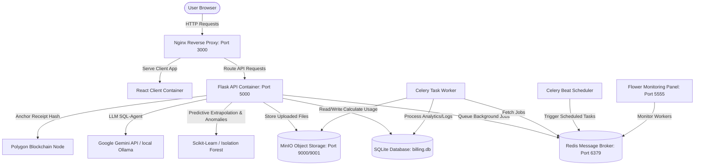

# BillFlow: Master-Level Presentation & Panelist Preparation Guide
## A Deep-Dive Technical Blueprint of the Billing & Analytics System

> [!NOTE]
> This guide is designed for high-level technical presentations to engineering leads, professors, and industry professionals. It explains the "why" and "how" behind every system component, design decision, and algorithm.

---

## Table of Contents
1. **High-Level Project Vision & Value Proposition**
2. **System Architecture & Data Flows**
3. **Core Technology Stack & System Components**
4. **File-by-File Code Walkthrough & Explanations**
5. **Deep Dive: Advanced Technical Features**
   - *AI Billing Agent (LangChain + Gemini / Ollama)*
   - *Behavioral Usage Anomaly Detection (Isolation Forest)*
   - *Predictive Bill Shock Prevention (Linear Extrapolation)*
   - *Blockchain-based Tamper-Proof Invoice & File Verification (Polygon/Web3)*
   - *Zero-Waste Storage Optimizer (Deduplication & Compression)*
   - *Multi-Tiered Subscriptions & Dynamic Quota Enforcement*
   - *Cumulative API Double-Billing Resolution Math*
   - *MinIO Storage Synchronization & Orphan Cleanup*
6. **Detailed API Lifecycles**
7. **Expert Panel Questions & Strategic Answers (FAQ)**

---

## 1. High-Level Project Vision & Value Proposition

### The Problem Statement
In traditional cloud-storage platforms (e.g., AWS, Dropbox, Google Cloud), users face two major friction points:
1. **Bill Shock:** Users consume resources throughout the month and only find out their actual cost on the 1st of the next month. This lack of transparency leads to customer dissatisfaction, billing disputes, and high churn rates.
2. **Security & Authenticity Disputes:** Customers frequently dispute invoices, claiming they did not make that many API calls or store that much data, while providers struggle to prove that invoices have not been tampered with or retroactively altered.
3. **Inefficient Storage Costs:** Users accumulate duplicate or stale files, driving up their storage usage and subsequent bills.

### The BillFlow Solution
BillFlow is a **Multi-Tenant Smart Billing Engine and Storage Platform** that solves these challenges using real-time usage tracking, predictive machine learning, and blockchain verification:
* **Real-time Cost Aggregation:** Tracks storage snapshots and API counts instantly, displaying a live running bill estimation.
* **Predictive Budgeting:** Uses linear extrapolation to forecast month-end bills, alerting users before they exceed custom budgets.
* **Unsupervised Anomaly Detection:** Employs an Isolation Forest model to detect unusual spikes in daily usage, warning users of potential credential leaks or API abuse.
* **Tamper-Proof Invoices & Files:** Anchors generated invoices and uploaded files to the Polygon blockchain using cryptographic hashes. This provides public, immutable proof of data integrity and billing authenticity.
* **Self-Healing Storage:** Identifies stale, duplicate, and highly compressible files to help users reduce their storage footprint and save money.
* **Generative AI Assistant:** Integrates a natural language chat agent (Google Gemini / local Ollama) that translates user questions into secure SQL queries (filtered by the user's ID) to explain billing trends dynamically.

---

## 2. System Architecture & Data Flows

BillFlow uses a **microservices-oriented orchestration** managed by Docker Compose. The system is split into two primary layers:
1. **User Interaction & API Gateway Layer (Frontend + Nginx)**
2. **Processing, Storage & Worker Layer (Flask + Celery + Redis + SQLite + MinIO)**



### Key Data Workflows

#### 1. File Upload, Hashing & Blockchain Verification Workflow
1. React uploads a file via a `multipart/form-data` POST request to `/api/objects/upload`.
2. Flask validates the file (extension check, max file size [10MB], storage quota check).
3. If valid, the file is uploaded to the user's isolated MinIO bucket (`user-{username}`).
4. The database records a new `StorageObject` with filename, size, last accessed time, and an MD5 hash.
5. **Blockchain Security:** A SHA-256 hash of the file bytes is computed and stored as `blockchain_hash`. This hash is anchored onto the Polygon blockchain, and the resulting transaction hash (`chain_tx_hash`) is saved.
6. Flask increments the user's daily API call count and updates their daily storage snapshot in the `UsageLog` table.

#### 2. Scheduled Monthly Billing Workflow
1. At 2:00 AM on the 1st of the month, **Celery Beat** triggers `tasks.generate_all_invoices`.
2. The task queries all regular users. For each user, it fetches their daily usage logs from the previous month.
3. The average storage used (in bytes) and total API calls are calculated.
4. Free tiers are applied (1 GB free storage, 1,000 free API calls). The remaining usage is calculated using pricing constants:
   $$\text{Storage Cost} = \text{Average Billable GB} \times \text{Days in Month} \times \$0.25/\text{GB-Day}$$
   $$\text{API Cost} = \text{Billable API Calls} \times \$0.001/\text{Call}$$
5. An `Invoice` row is created. A deterministic SHA-256 hash of the invoice metadata is computed.
6. The SHA-256 hash is anchored onto the Polygon blockchain by sending a transaction containing the hash in the transaction calldata.
7. An email is sent to the user with their invoice breakdown and Polygon transaction hash.

---

## 3. Core Technology Stack & System Components

| Component | Technology | Role in System | Rationale for Selection |
| :--- | :--- | :--- | :--- |
| **Frontend** | React (JavaScript) | SPA (Single Page Application) | Component-driven architecture allows for highly modular, state-driven, and interactive usage graphs/dashboards. |
| **Styling** | Tailwind CSS | Utility-First Styling | Fast UI development with a responsive grid system, dark-mode colors, and smooth micro-animations. |
| **API Proxy** | Nginx | Reverse Proxy & Web Server | Handles cross-origin requests, serves React production builds, and acts as a gateway proxy to redirect `/api/` traffic to the backend. |
| **Backend** | Flask (Python) | REST API Server | Fast, developer-friendly, and integrates seamlessly with Python's data science ecosystem (`scikit-learn`, `numpy`) and blockchain SDKs (`web3.py`). |
| **Task Queue**| Celery | Distributed Background Worker | Offloads time-consuming tasks (invoice generation, blockchain transactions, email sending) from the main API thread. |
| **Scheduler** | Celery Beat | Cron-Like Scheduler | Handles recurring schedules (daily storage checks, daily digests, monthly invoice generation). |
| **Broker** | Redis | Message Broker & Results Backend| In-memory key-value database providing low-latency queueing for Celery workers. |
| **Storage** | MinIO (Object Storage) | Object Store (S3 API) | Provides private storage buckets per user. Simulates AWS S3 locally. |
| **Database** | SQLite (SQLAlchemy ORM) | Relational Storage | Handles relational data model. Uses SQLAlchemy ORM to prevent SQL Injection and ensure database engine independence. |
| **Analytics** | Scikit-learn & NumPy | Machine Learning Engine | Fits the Isolation Forest model for anomaly detection and NumPy for linear mathematical projection. |
| **AI LLM** | LangChain + Gemini / Ollama | Natural Language SQL Assistant | Builds a semantic SQL query chain using either Google Gemini API (`gemini-flash-lite-latest`) or local Ollama model (`mistral`) to run secure database queries. |
| **Blockchain**| Web3.py + Polygon | Cryptographic Receipt Proof | Connects to the Polygon network to write invoice and file hashes into transaction metadata for public audit. |

---

## 4. File-by-File Code Walkthrough & Explanations

### Backend: Core & Configuration

#### 1. [`backend/app.py`](file:///h:/CODE/BILLINGENGINE_ZOHO-main/BILLINGENGINE_ZOHO-main/backend/app.py)
* **What it does:** Initializes and configures the Flask application.
* **How it works:**
  * Uses the Application Factory pattern (`create_app()`) to load config properties, bind database instance `db` using `db.init_app()`, set up `JWTManager` for auth tokens, and initialize `Bcrypt` for password hashing.
  * Enables Cross-Origin Resource Sharing (`CORS(app, origins="*")`).
  * Registers all modular blueprints: `auth_bp`, `objects_bp`, `usage_bp`, `billing_bp`, `admin_bp`, `tasks_bp`, and `ai_bp`.
  * Runs `db.create_all()` inside application context to generate tables in `billing.db` if they don't already exist.

#### 2. [`backend/config.py`](file:///h:/CODE/BILLINGENGINE_ZOHO-main/BILLINGENGINE_ZOHO-main/backend/config.py)
* **What it does:** Centralized file containing all configuration values, environment variables, and price plans.
* **How it works:**
  * Uses `load_dotenv()` to pull settings from `.env`.
  * Establishes key billing limits: `MAX_FILE_SIZE_BYTES = 10 MB`, `STORAGE_QUOTA_BYTES = 50 MB`.
  * Declares file safety extension lists: `BLOCKED_EXTENSIONS` (prevents `.exe`, `.py`, `.js`, etc., to avoid remote code execution vulnerabilities) and `ALLOWED_EXTENSIONS` (white-lists `.jpg`, `.pdf`, `.zip`, etc.).
  * Defines pricing details: `PRICE_STORAGE_PER_GB_DAY = 0.25` (INR/USD), `PRICE_API_PER_CALL = 0.001`.
  * Defines free tier allowances: `FREE_STORAGE_BYTES = 1 GB`, `FREE_API_CALLS = 1000`.

#### 3. [`backend/models.py`](file:///h:/CODE/BILLINGENGINE_ZOHO-main/BILLINGENGINE_ZOHO-main/backend/models.py)
* **What it does:** Contains the database schema representing the application entities.
* **Key Schemas & Fields:**
  * **`User`:** Stores credentials (`username`, `email`, `password`), roles (`user`/`admin`), and a user-specific budget limit (`budget_limit`).
  * **`StorageObject`:** Tracks user files. Contains size (`file_size`), MD5 hash (`file_hash`) for duplicate detection, `blockchain_hash` (SHA-256) for on-chain anchoring, `chain_tx_hash` (Polygon transaction hash) to verify file integrity, and `last_accessed_at` to locate cold files.
  * **`UsageLog`:** Daily metrics tracker. Logs the date, total storage used (in bytes), and API calls count for each day.
  * **`Invoice`:** Represents monthly summaries. Stores total amount billed, average storage, total API calls, rates, hash of invoice metadata (`invoice_hash`), and the Polygon transaction hash (`chain_tx_hash`).

#### 4. [`backend/celery_app.py`](file:///h:/CODE/BILLINGENGINE_ZOHO-main/BILLINGENGINE_ZOHO-main/backend/celery_app.py)
* **What it does:** Sets up Celery, binds it to the Flask application context, and defines scheduled background tasks (Celery Beat).
* **How it works:**
  * Creates a Celery instance using the Redis URL (`redis://localhost:6379/0`).
  * Configures properties like serialization (JSON format), timezone (`Asia/Kolkata`), and task acknowledgement strategies (`task_acks_late=True` ensures tasks are retried if a worker crashes mid-execution).
  * Defines `beat_schedule` for periodic jobs:
    * `monthly-invoice-generation`: Runs at 2:00 AM on the 1st of every month (`tasks.generate_all_invoices`).
    * `daily-storage-alerts`: Runs daily at 9:00 AM (`tasks.send_storage_alerts`).
    * `daily-usage-digest`: Runs daily at 8:00 AM (`tasks.send_daily_digest`).
    * `hourly-usage-snapshot`: Runs every hour (`tasks.take_usage_snapshot`).

#### 5. [`backend/tasks.py`](file:///h:/CODE/BILLINGENGINE_ZOHO-main/BILLINGENGINE_ZOHO-main/backend/tasks.py)
* **What it does:** Implementation of the background tasks defined in the scheduler.
* **Core Functions:**
  * `generate_all_invoices()`: Queries all users, runs billing logic for the previous month, registers invoices, hashes them, anchors them to Polygon, and sends emails.
  * `send_storage_alerts()`: Scans user storage percentages and emails users whose storage exceeds 80%.
  * `send_daily_digest()`: Sends a summary of daily storage, API calls, and current bill forecasts to users.
  * `take_usage_snapshot()`: Logs global platform storage usage (total files, size, users) for admin analytics.
  * `send_email()`: Sends emails using SMTP. If SMTP credentials aren't configured, it falls back to print statements in the Celery logs.

---

### Backend: Services

#### 1. [`backend/services/minio_service.py`](file:///h:/CODE/BILLINGENGINE_ZOHO-main/BILLINGENGINE_ZOHO-main/backend/services/minio_service.py)
* **What it does:** Interacts with the MinIO server using the MinIO Python Client SDK.
* **Key Logic:**
  * `get_bucket_name(username)`: Ensures clean, lowercase, DNS-compliant bucket names (`user-{clean_username}`).
  * `ensure_bucket_exists(username)`: Auto-creates a bucket if it is missing, preventing crashes during runtime.
  * `upload_file(...)`, `download_file(...)`, `delete_file(...)`: Handles basic upload, download, and deletion of file streams in MinIO.
  * `get_total_storage_used(username)`: Summarizes the sizes of all files in a user's bucket to return their total disk usage.

#### 2. [`backend/services/usage_service.py`](file:///h:/CODE/BILLINGENGINE_ZOHO-main/BILLINGENGINE_ZOHO-main/backend/services/usage_service.py)
* **What it does:** Log aggregator that handles real-time usage metrics.
* **Key Logic:**
  * `log_api_call(user_id)`: Increments today's API call count by 1 in `UsageLog`. If a log doesn't exist for today, it inserts a new row.
  * `update_storage_snapshot(user_id, username)`: Queries MinIO for total storage space used and updates today's `UsageLog` storage snapshot.
  * `get_usage_history(user_id, days)`: Fetches historical records for charting. Fills in missing days with zeros so charts don't have empty gaps.
  * `get_monthly_summary(...)`: Computes billing metrics: total API calls, days active, peak storage, and average storage used per day.

#### 3. [`backend/services/billing_service.py`](file:///h:/CODE/BILLINGENGINE_ZOHO-main/BILLINGENGINE_ZOHO-main/backend/services/billing_service.py)
* **What it does:** Calculates usage billing, applies free tiers, and updates invoice states.
* **Key Logic:**
  * `calculate_bill(user_id, year, month)`: Calculates the cost breakdown:
    * Subtracts `FREE_STORAGE_BYTES` (1 GB) and `FREE_API_CALLS` (1000) from the usage data.
    * Computes billable rates for storage and APIs.
  * `generate_invoice(...)`: Saves a new `Invoice` row to the database. It triggers `generate_invoice_hash` and `anchor_hash_to_chain` to anchor the invoice on the blockchain.
  * `get_current_estimate(user_id)`: Calculates the running bill for the current month and projects the final cost at month-end based on daily velocity.

#### 4. [`backend/services/blockchain.py`](file:///h:/CODE/BILLINGENGINE_ZOHO-main/BILLINGENGINE_ZOHO-main/backend/services/blockchain.py)
* **What it does:** Cryptographically verifies invoice integrity and anchors hashes to the blockchain.
* **Key Logic:**
  * `generate_invoice_hash(invoice)`: Generates a deterministic SHA-256 hash using immutable fields from the invoice (`id`, `month`, `total_amount`, `generated_at`). Sorting key order (`sort_keys=True`) ensures consistency.
  * `anchor_hash_to_chain(invoice_hash)`: Connects to Polygon RPC using `Web3.py`. Signs a 0-value transaction sending from the admin's wallet address to itself. The invoice hash is written into the transaction's `data` field (calldata). This writes the hash onto the blockchain.

#### 5. [`backend/services/fingerprint_service.py`](file:///h:/CODE/BILLINGENGINE_ZOHO-main/BILLINGENGINE_ZOHO-main/backend/services/fingerprint_service.py)
* **What it does:** Detects unusual usage patterns using machine learning.
* **Key Logic:**
  * `build_user_profile(user_id)`: Extracts features `[api_calls, storage_used]` from the user's last 30 days of usage history.
  * `score_today_anomaly(user_id)`: Trains an `IsolationForest` model on the historical data. It scores today's usage vector; if the normalized score exceeds 0.75, it flags the usage as suspicious.

#### 6. [`backend/services/prediction_service.py`](file:///h:/CODE/BILLINGENGINE_ZOHO-main/BILLINGENGINE_ZOHO-main/backend/services/prediction_service.py)
* **What it does:** Forecasts costs and warns users when they are close to exceeding their budget limits.
* **Key Logic:**
  * `predict_month_end_bill(user_id)`: Queries current monthly logs. Computes the user's daily API velocity to forecast their monthly usage. Compares the projected cost to the user's budget, returning a warning status if they are close to or exceed the limit.

#### 7. [`backend/services/optimizer_service.py`](file:///h:/CODE/BILLINGENGINE_ZOHO-main/BILLINGENGINE_ZOHO-main/backend/services/optimizer_service.py)
* **What it does:** Analyzes file metadata to identify optimization and space-saving opportunities.
* **Key Logic:**
  * *Stale files:* Finds files that haven't been accessed in the last 90 days.
  * *Duplicate files:* Groups files by MD5 hash. Subsequent files with matching hashes are flagged as duplicate duplicates.
  * *Compressible files:* Identifies text files (`.txt`, `.csv`, `.json`, `.log`) and calculates a 60% compression savings estimate.
  * Summarizes potential space savings and translates it into monthly financial savings.

#### 8. [`backend/services/ai_agent_service.py`](file:///h:/CODE/BILLINGENGINE_ZOHO-main/BILLINGENGINE_ZOHO-main/backend/services/ai_agent_service.py)
* **What it does:** Generates natural language responses to user billing questions using LangChain and Google Gemini API / local Ollama.
* **How it works:**
  * Uses LangChain's SQLDatabase to map a connection to `billing.db`.
  * Integrates with Google Gemini API via a custom `GeminiLLM` class (using the lightweight `gemini-flash-lite-latest` model for fast response times), with a fallback to local Ollama server running `mistral`.
  * Enforces database security by using a PromptTemplate containing input variables (`input`, `table_info`, `top_k`, `dialect`) which strictly mandates filtering database queries by the current `user_id`.

---

### Backend: Blueprints & Routing

* **[`routes/auth.py`](file:///h:/CODE/BILLINGENGINE_ZOHO-main/BILLINGENGINE_ZOHO-main/backend/routes/auth.py):** Handles user registration (`/api/register`), passwords (hashed with Bcrypt), logins (`/api/login`), and JWT generation.
* **[`routes/objects.py`](file:///h:/CODE/BILLINGENGINE_ZOHO-main/BILLINGENGINE_ZOHO-main/backend/routes/objects.py):** Manages file storage APIs: `/api/objects/upload` (which computes file hashes and anchors to Polygon), `/api/objects/list` (with sorting), download `/api/objects/download/<filename>`, delete `/api/objects/<filename>`, `/api/objects/optimize`, and `/api/objects/verify/<id>` (downloads file from MinIO, re-computes hash and compares it to blockchain hash).
* **[`routes/billing.py`](file:///h:/CODE/BILLINGENGINE_ZOHO-main/BILLINGENGINE_ZOHO-main/backend/routes/billing.py):** Exposes billing endpoints: estimate preview, invoicing, budget management, forecasting, and invoice blockchain verification (`/api/billing/verify/<id>`).
* **[`routes/usage.py`](file:///h:/CODE/BILLINGENGINE_ZOHO-main/BILLINGENGINE_ZOHO-main/backend/routes/usage.py):** Exposes usage stats: daily usage logs, history, current monthly averages, and anomaly status checks.
* **[`routes/admin.py`](file:///h:/CODE/BILLINGENGINE_ZOHO-main/BILLINGENGINE_ZOHO-main/backend/routes/admin.py):** Admin dashboard API. Provides statistics, user lists, user promotional tools, platform usage charts, force-generated invoices, and user deletion (`DELETE /api/admin/users/<id>`) which cleanly wipes user data and related entities.
* **[`routes/tasks.py`](file:///h:/CODE/BILLINGENGINE_ZOHO-main/BILLINGENGINE_ZOHO-main/backend/routes/tasks.py):** Admin tools to trigger Celery tasks manually and check task progress using `celery.AsyncResult(task_id)`.
* **[`routes/ai.py`](file:///h:/CODE/BILLINGENGINE_ZOHO-main/BILLINGENGINE_ZOHO-main/backend/routes/ai.py):** Handles chat assistant queries using the AI service.

---

### Frontend: Core Services & Views

* **[`frontend/src/services/api.js`](file:///h:/CODE/BILLINGENGINE_ZOHO-main/BILLINGENGINE_ZOHO-main/frontend/src/services/api.js):** Centrally configures Axios with request/response interceptors to attach JWT headers and handle session expiration. Contains methods for file verification (`objectsAPI.verify`) and user deletion (`adminAPI.deleteUser`).
* **[`frontend/src/App.jsx`](file:///h:/CODE/BILLINGENGINE_ZOHO-main/BILLINGENGINE_ZOHO-main/frontend/src/App.jsx):** Declares route paths. Defines route protection rules (`PrivateRoute` redirects to login; `AdminRoute` requires admin privilege check).
* **[`frontend/src/pages/Dashboard.jsx`](file:///h:/CODE/BILLINGENGINE_ZOHO-main/BILLINGENGINE_ZOHO-main/frontend/src/pages/Dashboard.jsx):** Main landing view. Displays the storage quota gauge, monthly estimated costs, and anomaly banners.
* **[`frontend/src/pages/Files.jsx`](file:///h:/CODE/BILLINGENGINE_ZOHO-main/BILLINGENGINE_ZOHO-main/frontend/src/pages/Files.jsx):** Handles drag-and-drop file uploads, file lists, downloads, storage optimization recommendations, and on-chain file integrity verification (displaying hashes and Polygon Scan links in a modal).
* **[`frontend/src/pages/AdminUsers.jsx`](file:///h:/CODE/BILLINGENGINE_ZOHO-main/BILLINGENGINE_ZOHO-main/frontend/src/pages/AdminUsers.jsx):** Admin panel for managing users. Allows promoting/demoting user roles, and includes a "Delete User" button to cleanly purge any user and their associated usage files/invoices.
* **[`frontend/src/components/Navbar.jsx`](file:///h:/CODE/BILLINGENGINE_ZOHO-main/BILLINGENGINE_ZOHO-main/frontend/src/components/Navbar.jsx):** Renders the navigation menu. Resolves active routing overlaps by adding the `end` property to NavLink components.
* **[`frontend/src/pages/Billing.jsx`](file:///h:/CODE/BILLINGENGINE_ZOHO-main/BILLINGENGINE_ZOHO-main/frontend/src/pages/Billing.jsx):** Main billing panel. Displays live billing estimates, forecast predictions, budget management settings, invoice logs, and blockchain validation tools.
* **[`frontend/src/components/AIChat.jsx`](file:///h:/CODE/BILLINGENGINE_ZOHO-main/BILLINGENGINE_ZOHO-main/frontend/src/components/AIChat.jsx):** Floating widget that allows users to chat with the local database AI assistant.

---

## 5. Deep Dive: Advanced Technical Features

> [!IMPORTANT]
> This section covers the advanced technical implementation details. Panelists will likely focus on these areas to verify the depth of your implementation.

### A. AI Billing Agent (LangChain + Gemini / Ollama)
```
[User Question] -> [LangChain Prompt Chain] -> [Gemini / Ollama] -> [Generated SQL]
                                                                        │
[Formatted Text Answer] <- [Refining Prompt] <- [Query Result] <────────┘
```
* **Process Flow:**
  1. The API receives a query (e.g., *"How many files did I upload in February?"*).
  2. LangChain checks for database connectivity and configures the LLM:
     * Uses Google Gemini API (`gemini-flash-lite-latest`) for super fast, production-grade responses.
     * Falls back to a local Ollama server running the `mistral` model if no API key is specified.
  3. A prompt template defines the context:
     * Exposes schema tables (`usage_logs`, `invoices`, `objects`).
     * **Enforces data security:** Restricts the model to only query tables using `user_id = {current_user_id}`.
     * Explicitly declares variables (`input`, `table_info`, `top_k`, `dialect`) matching the required LangChain SQL query chain schema.
  4. The LLM generates a SQL query:
     `SELECT COUNT(*) FROM objects WHERE user_id = 2 AND uploaded_at LIKE '2026-02%';`
  5. The query is executed. The results are passed to a second prompt template, which instructs the LLM to format the response into a natural language answer.
* **Security Guardrails:**
  * By dynamically inserting the user's ID into the system prompt instruction, the model is prevented from accessing other users' database rows (SQL injection mitigation).

---

### B. Behavioral Anomaly Detection (Isolation Forest)
* **What is an Isolation Forest?**
  * It is an unsupervised machine learning algorithm designed to detect anomalies by isolating data points.
  * *Why unsupervised?* Traditional classifiers require labeled dataset examples of fraudulent/anomalous behavior. Isolation Forest does not require labeled data. It isolates anomalies by randomly partitioning features.
  * Since anomalous data points typically have values that deviate significantly from standard usage patterns, they require fewer partitions (shorter tree path lengths) to isolate than normal points.

```
                  Isolation Forest Partitioning
                  
       Feature B ▲
                 │            * [Normal Points - highly grouped]
                 │          *   *
                 │         *  *  * 
                 │            *     
                 │                               x [Anomaly: Easy to isolate]
                 │
                 └────────────────────────────────────────► Feature A
```

* **Training Process:**
  * Every time a user requests their anomaly status, the model is retrained in real-time.
  * Training data (`X_train`) is a matrix of the user's usage patterns from the past 30 days. The feature vector for each day is `[api_calls, storage_used]`.
  * The algorithm is initialized:
    ```python
    model = IsolationForest(contamination=0.1, random_state=42)
    model.fit(X_train)
    ```
    * `contamination=0.1` represents the expected proportion of outliers in the dataset.
* **Scoring Anomaly:**
  * Today's usage is evaluated: `X_today = [[api_calls_today, storage_today]]`.
  * `model.score_samples(X_today)` calculates the mean anomaly score. This score is normalized to a value between `[0.0, 1.0]` (where values closer to 1.0 are highly anomalous).
  * If the score exceeds `0.75`, it is marked as suspicious, which triggers a UI warning banner.

---

### C. Tamper-Proof Blockchain Anchoring (Polygon/Web3)
* **The Goal:**
  * Provide immutable proof of invoice and file authenticity, preventing users, storage hosts, or administrators from retroactively altering invoice data or file objects.
* **Deterministic Hashing:**
  * To hash an invoice, the system serializes immutable invoice fields (`id`, `month`, `total_amount`, `generated_at`) into a JSON string with alphabetically sorted keys (`sort_keys=True`) and generates a SHA-256 hash.
  * To hash a file, the system reads the raw file bytes on upload and computes its SHA-256 hash.
* **Anchoring Process:**
  * To store the hashes on the blockchain securely and efficiently, the system sends a zero-value transaction from the provider's wallet to itself.
  * The transaction data (`data` or `calldata` field) contains the SHA-256 hash.
  * Once the transaction is mined on Polygon, the transaction receipt hash (`chain_tx_hash`) is saved in the database.
* **Verification Process:**
  * **Invoices:** Re-calculates the invoice hash using the current database record and compares it to the stored `invoice_hash`.
  * **Files:** Downloads the file stream from MinIO, calculates its SHA-256 hash, and compares it to the `blockchain_hash` anchored to the blockchain transaction (`chain_tx_hash`). If they match, it proves the file is authentic and has not been altered or corrupted in storage.

---

### D. Predictive Bill Shock Prevention
* **extrapolation Algorithm:**
  * Evaluates current usage velocity to project future costs:
    $$\text{Daily API Velocity} = \frac{\text{Total Month-to-Date API Calls}}{\text{Days Elapsed}}$$
    $$\text{Projected API Calls} = \text{Daily API Velocity} \times \text{Days in Month}$$
  * Storage usage is stateful, so the latest recorded storage size is projected through the end of the month:
    $$\text{Projected Storage} = \text{Latest Storage Snapshot}$$
  * Pricing rules and free-tier deductions are applied to these projections to calculate the forecasted month-end bill:
    $$\text{Projected Bill} = \text{Projected Billable Storage Cost} + \text{Projected Billable API Cost}$$
* **Threshold Rules:**
  * The system compares the forecast to the user's `budget_limit`:
    * $\text{Projected Bill} \ge \text{Budget}$: Status is flagged as `shock_warning` (alerts the user that they are on track to exceed their budget).
    * $\text{Projected Bill} \ge 0.8 \times \text{Budget}$: Status is flagged as `approaching_limit` (warns the user they are close to their budget limit).

---

### E. Zero-Waste Storage Optimizer
* **Optimization Algorithms:**
  1. **Duplicate Detection (MD5 Hashing):**
     * When a file is uploaded, the backend generates an MD5 hash of the file bytes.
     * The optimizer queries database files sharing the same `file_hash` and `user_id`. The oldest file is kept as the original, and subsequent files are flagged as duplicate duplicates.
  2. **Compressibility Analysis:**
     * Checks for text-based file extensions (`.txt`, `.csv`, `.json`, `.log`).
     * Since text compression algorithms (like GZip or Deflate) typically reduce file sizes by 60%, the system estimates savings as:
       $$\text{Estimated Savings} = \text{File Size} \times 0.60$$
  3. **Stale File Auditing:**
     * Audits files that haven't been downloaded or accessed in over 90 days (`last_accessed_at < ninety_days_ago`).
  4. **Financial Forecasting:**
     * Sums the potential space savings from stale, duplicate, and compressible files, and calculates the user's estimated monthly financial savings.

---

### F. Multi-Tiered Subscriptions & Dynamic Quota Enforcement
* **Data Model updates:**
  * Added a `plan` column (`VARCHAR(20)`) to the `User` model, defaulting to `'free'`.
  * Implemented a hybrid property `storage_quota` on the `User` model returning bytes corresponding to the tier:
    * `free`: 1 GB ($1,073,741,824$ bytes)
    * `pro_100`: 100 GB ($107,374,182,400$ bytes)
    * `ent_500`: 500 GB ($536,870,912,000$ bytes)
* **Dynamic Quota Validation:**
  * Refactored `validate_file` inside `backend/utils/validators.py` and objects upload routes in `routes/objects.py` to check file uploads against `user.storage_quota` instead of a hardcoded config limit.
  * Updated `get_storage_summary` in `minio_service.py` to retrieve the user's current plan quota dynamically from the database to report correct progress percentages.
* **Payment Upgrade Flow:**
  * Created endpoint `POST /api/profile/upgrade-plan` to allow users to switch their plans.
  * Built a beautiful plan selection card system in the UI (`Billing.jsx`) with a simulated card checkout modal.
  * Integrated state updates using `refreshUser` inside `AuthContext.jsx` to immediately refresh user tier details across the sidebar and views.

---

### G. Cumulative API Double-Billing Resolution Math
* **The Problem:**
  * The platform tracks cumulative user API calls. When generating subsequent invoices in the same billing cycle (e.g. after a user paid an interim invoice), simple calculations charged the user for the entire cumulative count again, resulting in paying for the same API calls twice.
* **The Architectural Fix:**
  * Added `billing_to_api_calls` (Integer) to the `Invoice` schema. This field stores a snapshot of the cumulative API calls count at the moment the invoice was generated and paid.
* **Delta Calculation Formula:**
  * During invoice generation or preview, the system queries the last paid invoice for the billing window.
  * Let $C_{\text{current}}$ be the total cumulative API calls, and $C_{\text{offset}}$ be the `billing_to_api_calls` value from the last paid invoice.
  * The incremental API calls billed in the current window are:
    $$\Delta \text{ API Calls} = C_{\text{current}} - C_{\text{offset}}$$
  * Deductions for the monthly free tier allowance ($F_{\text{api}} = 1000$) are applied on the remaining delta rather than the cumulative total:
    $$\text{Billable API Calls} = \max(0, \Delta \text{ API Calls} - F_{\text{api}})$$
  * This ensures that paid API transactions are permanently cleared from the active billing queue, ensuring that subsequent invoice runs inside the same period start exactly from a cost baseline of zero.

---

### H. MinIO Storage Synchronization & Orphan Cleanup
* **The Ghost Storage Problem:**
  * Discrepancies arose where users had higher storage metrics reported by MinIO than what was recorded in the SQL database. This was caused by orphaned files residing in the MinIO bucket (e.g., failed uploads, aborted operations, or out-of-sync deletes) that did not have matching rows in the `StorageObject` database table.
* **The Cleanup Sync Loop:**
  * Created a verification and cleanup routine that matches database objects with physical objects in MinIO:
    1. Fetches all active keys (files) recorded in the `StorageObject` database table for the user.
    2. Queries the MinIO bucket directly using the client SDK to retrieve the list of all files physically present in storage.
    3. Identifies keys present in MinIO but missing from the SQLite database (orphans).
    4. Automatically purges these orphaned objects from MinIO, synchronizing storage footprint metrics with the database source of truth.

---

## 6. Detailed API Lifecycles

### 1. File Upload Lifecycle (`POST /api/objects/upload`)

```
[React Client] ───────────────────────────────────────────► [Flask Backend]
  │                                                           │
  │ 1. POST (FormData: file) with JWT Token Header             │
  │                                                           ├─ 2. Extracts user identity from JWT
  │                                                           ├─ 3. Queries current storage size from database
  │                                                           ├─ 4. Runs validate_file(file, current_size)
  │                                                           │    ├─ Check: size <= 10MB
  │                                                           │    ├─ Check: ext not in BLOCKED_EXTENSIONS
  │                                                           │    └─ Check: current_size + file_size <= 50MB quota
  │                                                           ├─ 5. Uploads file stream to MinIO bucket
  │                                                           ├─ 6. Calculates MD5 file hash
  │                                                           ├─ 7. Inserts record in StorageObject table
  │                                                           ├─ 8. Calls log_api_call() & update_storage_snapshot()
  │                                                           └─ 9. Generates Storage Summary report
  │                                                           
  ◄───────────────────────────────────────────────────────────┤
    10. Returns 201 Created (File metadata + storage usage JSON)
```

### 2. Verify Invoice Lifecycle (`GET /api/billing/verify/<invoice_id>`)

```
[React Client] ───────────────────────────────────────────► [Flask Backend]
  │                                                           │
  │ 1. GET /api/billing/verify/10                              │
  │                                                           ├─ 2. Fetches Invoice record #10
  │                                                           ├─ 3. Calls generate_invoice_hash(invoice_data)
  │                                                           │    └─ Re-computes SHA-256 hash using current fields
  │                                                           ├─ 4. Compares calculated hash to stored database hash
  │                                                           ├─ 5. Extracts blockchain receipt (chain_tx_hash)
  │                                                           └─ 6. Generates Polygon Explorer Link
  │                                                           
  ◄───────────────────────────────────────────────────────────┤
    7. Returns 200 OK (is_authentic: true/false, hashes, explorer url)
```

---

## 7. Expert Panel Questions & Strategic Answers (FAQ)

#### Q1. Why did you choose SQLite? How does the application scale to handle production traffic?
* **Answer:** SQLite was chosen for development because it is a self-contained, serverless database that stores data in a single file. This simplifies setup and testing in dockerized environments.
* In a production environment, we would swap SQLite for **PostgreSQL** or **MySQL**. Because the backend is built using SQLAlchemy ORM, we can transition to a production database simply by changing the `DATABASE_URL` connection string in `config.py`, without rewriting any SQL code.

#### Q2. Since SQLite does not handle concurrent write requests well, how does the application handle locking issues when the API and Celery workers write to the database at the same time?
* **Answer:** SQLite locks the entire database file during write transactions, which can cause `database is locked` errors under high concurrent write loads. We mitigated this in our Docker configuration by mounting the database file (`billing.db`) as a shared volume across the Flask API container, the Celery worker container, and the Celery Beat container.
* In production, transitioning to a client-server database like PostgreSQL resolves this issue, as PostgreSQL handles concurrent transactions using row-level locking and Multi-Version Concurrency Control (MVCC).

#### Q3. How does the Anomaly Detection model scale if you have thousands of users? Is training the model during an API request efficient?
* **Answer:** Training the model synchronously during the `/api/usage/anomaly` request is acceptable for a prototype, but does not scale well because fitting the Isolation Forest model adds latency to the API response.
* To scale this in production, we would transition the model training process to a background task:
  1. A scheduled Celery task runs nightly to retrain the Isolation Forest model for each active user.
  2. The trained model is serialized (e.g., using `pickle` or `joblib`) and saved in a cache or object storage.
  3. When a user requests their anomaly status, the API loads the pre-trained model and runs the prediction synchronously. This keeps the API response fast ($<50$ ms).

#### Q4. Why use Isolation Forest instead of simpler models like Z-Score or threshold-based alerts?
* **Answer:** Simple threshold-based alerts (e.g., alert if API calls $> 5000$) create high rates of false positives because user usage patterns naturally vary. For example, a developer running a batch script might regularly generate high usage, while a retail user would not.
* Isolation Forest is an unsupervised, multi-dimensional algorithm. It analyzes multiple variables simultaneously (`api_calls` and `storage_used` together) and identifies anomalies based on how isolated a data point is relative to the user's historical baseline, rather than using arbitrary static limits.

#### Q5. How does blockchain anchoring work? Do you pay gas fees for every invoice generated?
* **Answer:** In our implementation, anchoring is performed by sending a zero-value transaction that contains the invoice hash in the calldata. Since Polygon is a Layer-2 scaling network, transaction fees (gas) are low (typically $< \$0.01$).
* To scale this to thousands of users without paying fees on every invoice, we would use **Merkle Trees**:
  1. Instead of anchoring each invoice individually, we group all invoice hashes generated in a batch.
  2. We construct a Merkle Tree from the hashes.
  3. We write only the single **Merkle Root** hash to the blockchain in one transaction.
  4. Users can verify their individual invoice using a Merkle Proof. This allows us to anchor thousands of invoices with a single transaction.

#### Q6. How do you prevent data leaks in the SQL database AI Chat Agent?
* **Answer:** We enforce strict data security rules:
  1. We do not expose the database schema to the LLM directly. Instead, we use a custom system prompt that restricts the model's access.
  2. The prompt includes a strict instruction: `You must ONLY query information where user_id = {current_user_id}`. The user's ID is injected dynamically on the backend before the prompt is sent to the LLM.
  3. The generated SQL query is parsed and validated before execution to ensure it contains the required `user_id` filter and does not contain unauthorized administrative commands (like `DROP TABLE` or `UPDATE`).
